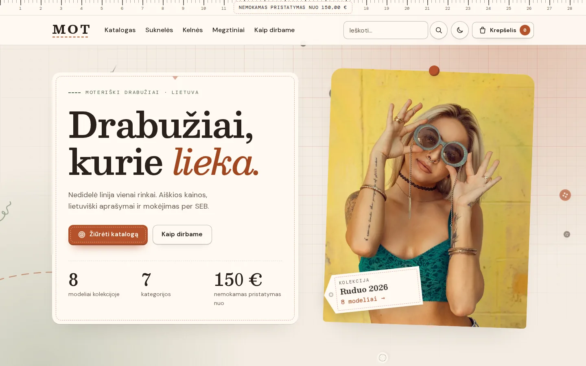
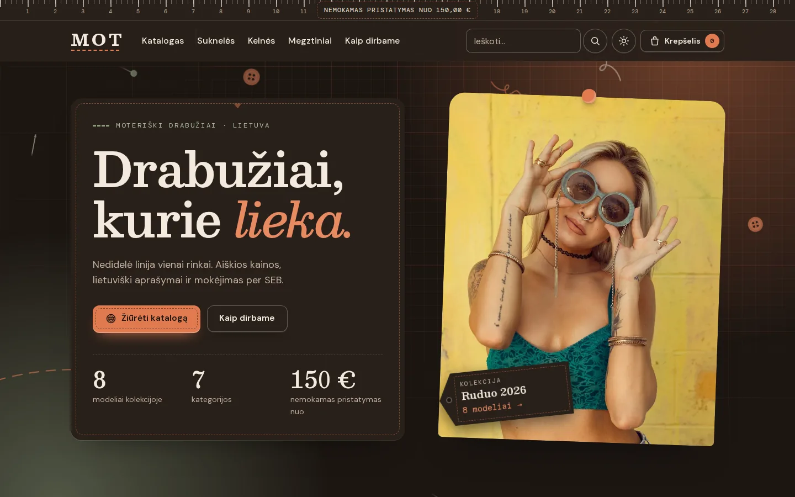
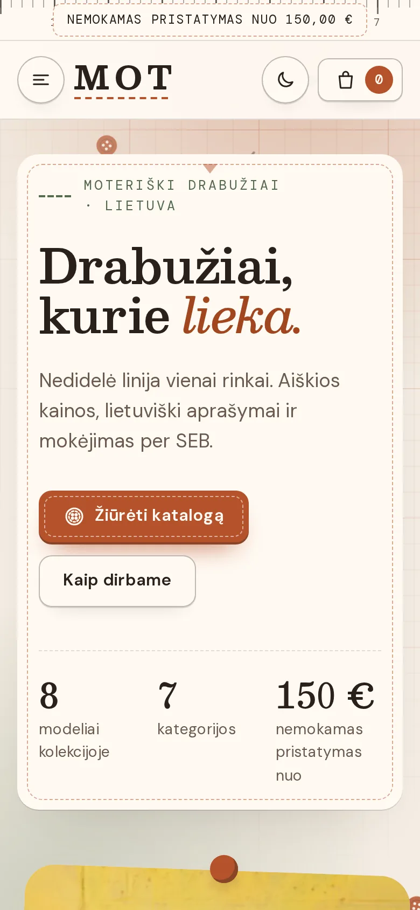

**English** · [Lietuviškai](README.lt.md)

# MOT – women's fashion shop

A women's clothing shop for Lithuania with its own admin panel and SEB bank link payments, dressed as a tailor's studio.

**[Live demo](https://brutall100.github.io/mot-fashion-shop/)** · **[Source code](https://github.com/brutall100/mot-fashion-shop)**



| Dark mode | Phone (390 px) |
| --- | --- |
|  |  |

## About

MOT is a small online shop: a buyer browses the collection, picks a size, fills in the checkout form and pays through the SEB internet bank. The shop owner adds products, prices and photos and follows orders in the admin panel. All texts are in Lithuanian and prices are in euro.

The project runs in two modes:

| | Live demo (GitHub Pages) | Full version (your computer or a server) |
| --- | --- | --- |
| Data | saved in the visitor's browser (`localStorage`) | SQLite database |
| Payment | a clearly marked test bank page | SEB Bank Link with RSA signatures (test bank until contract keys are added) |
| Admin | works in the browser, password `mot-admin` | protected by a hashed password and a signed cookie |
| Needs | nothing – just open the link | Node.js 22.14+ |

The demo is a static copy of the same app: the same pages and components, only the data layer is swapped for a browser store.

## Features

- **Shop:** catalog with categories, search that understands Lithuanian letters (`siaure` finds „Šiaurė“), sorting; product page with gallery, sizes and quantity; cart with a free-shipping progress bar; checkout with LP Express, Omniva, courier or pickup.
- **Payments:** SEB Bank Link (Payment Initiation v009) – requests signed with RSA-SHA512, bank replies verified, amounts checked; prices are always recalculated on the server.
- **Admin:** products (create, edit, hide, delete, photos), orders and their status, contacts and free-shipping threshold, SEB keys. Uploaded photos are shrunk in the browser, converted to WebP and stripped of EXIF (GPS) data.
- **Design – "Ateljė":** a live background (pattern paper, warm lamp glows, a stitch being sewn, falling buttons, pins, needles and threads); a measuring-tape top bar; product cards that hang like clothing tags; buttons that look like sewn-on labels with a ripple; a tag that flies into the cart; numbers that count up; blocks that appear on scroll.
- **Light and dark mode:** follows the system setting, has a switch, remembers the choice and never flashes while loading.
- **Accessibility:** skip link, visible focus, labels on every field, alt texts, `prefers-reduced-motion` stops all motion, WCAG AA contrast checked for every colour pair.
- **Security:** admin password stored as a scrypt hash (never as plain text), signed httpOnly cookie, limit on wrong login attempts, SQL with placeholders, secrets in `.env`.

## Built with

- [Next.js 16](https://nextjs.org/) (App Router, Turbopack), [React 19](https://react.dev/), TypeScript
- [Tailwind CSS 4](https://tailwindcss.com/) for layout + plain CSS for the themed pieces
- SQLite built into Node.js (`node:sqlite`) and Node `crypto` – no extra database server
- GitHub Actions → GitHub Pages for the demo

**Fonts** (Google Fonts via `next/font`, self-hosted): **Besley** for headings, **DM Sans** for text, **DM Mono** for prices and order numbers. Each one was checked with every Lithuanian letter (ą č ę ė į š ų ū ž) – several popular fonts break „ū“.

**Colour palette** – all colours live in one file, [`app/styles/palette.css`](app/styles/palette.css):

| Token | Light | Dark | Used for |
| --- | --- | --- | --- |
| `--bg` | `#F3ECE2` linen | `#1C1612` walnut | page background |
| `--surface` | `#FFFAF3` | `#28201A` | cards, header, forms |
| `--text` | `#2B211B` espresso | `#F3E9DC` cream | text (13.4:1 / 14.9:1) |
| `--accent` | `#B5522B` terracotta | `#E07A50` | buttons, badges, glow |
| `--accent-2` | `#6F8466` sage | `#9DB38F` | second accent, chalk marks |

Terracotta is a little too light for small text on linen (4.3:1), so small text uses a darker shade, `#A2461F` (5.2:1).

## What I learned

- How a bank link works end to end: building the signed packet, sending the buyer to the bank with a POST form and trusting only the bank's signed answer.
- Running one Next.js app in two modes: `pageExtensions` picks `*.demo.tsx` routes for a static export, while the full version keeps API routes and the database.
- Sharing business rules between the server and the browser (prices, stock, shipping) so the demo behaves like the real shop.
- Building a themed design system on CSS variables with `light-dark()`, and a live background that animates only `transform` and `opacity`.
- Checking fonts for Lithuanian letters before choosing them, and measuring contrast instead of guessing.
- Storing passwords as scrypt hashes and keeping secrets out of git.

## Run it locally

You need [Node.js](https://nodejs.org/) 22.14 or newer.

```bash
git clone https://github.com/brutall100/mot-fashion-shop.git
cd mot-fashion-shop
npm install
cp .env.example .env
npm run dev
```

- Shop: http://localhost:3000
- Admin: http://localhost:3000/admin – while `ADMIN_PASSWORD_HASH` is empty, `npm run dev` accepts the password `mot-admin`.

**Production (`npm start`) needs a real password:**

```bash
npm run hash-password -- "your-long-password"   # prints ADMIN_PASSWORD_HASH=...
# paste that line into .env, then:
npm run build
npm start
```

**The browser demo (the same files as on GitHub Pages):**

```bash
npm run build:demo   # writes the static site to out/
npx serve out        # open the address it prints
```

**Tests:** `npm test` (checkout rules, catalog search, password hashing, SEB signatures, shipping).

### Environment variables (`.env`)

| Name | What it is |
| --- | --- |
| `ADMIN_PASSWORD_HASH` | admin password hash from `npm run hash-password` |
| `AUTH_SECRET` | secret for signing the login cookie (16+ characters); created automatically if empty |
| `APP_URL` | public address of the shop without a trailing slash – the bank returns the buyer here |
| `MOT_DB_PATH` | where the SQLite file lives (default `data/mot.db`) |

### Connecting SEB

Until all four contract values are saved in **Admin → SEB**, payments go to the test bank and no money moves:

1. merchant ID (`VK_SND_ID`, up to 15 characters);
2. bank address starting with `https://` (SEB, BIC `CBVILT2X`, is often `https://pi.swedbank.com/LT/CBVILT2X`);
3. your private RSA key (PEM) – the public part goes to the bank;
4. the bank certificate used to verify replies.

Request `1012`, version `009`, language `LIT`, currency `EUR`. Return addresses for the contract: `https://your-domain/api/seb/return` and `https://your-domain/api/seb/cancel`.

## Project structure

```text
app/
  (shop)/            shop pages: home, katalogas, preke, krepselis, atsiskaitymas, uzsakymas, bankas
  admin/             admin pages: prisijungti, prekes, uzsakymai, seb, parduotuve
  api/               checkout, SEB return/cancel, test bank, admin API (full version only)
  styles/            palette.css (all colours), base, components, live background
  *.demo.tsx         the same routes for the static GitHub Pages demo
components/          UI pieces; views/ are shared by both modes, demo/ reads the browser store
lib/                 rules shared by server and browser (catalog, checkout, shipping, money),
                     db.ts (SQLite), seb.ts + payments.ts (bank link), auth.ts + password.ts,
                     demo/store.ts (browser store), client-api.ts (server or demo calls)
public/images/       WebP photos (products 720 px, hero 960 px)
scripts/             build-demo.mjs, hash-password.ts
docs/                screenshots for this README
.github/workflows/   GitHub Pages deployment
```

## Credits

- Product and interior photos: [Unsplash](https://unsplash.com/) (Unsplash License).
- Fonts: Besley, DM Sans and DM Mono from [Google Fonts](https://fonts.google.com/) (SIL Open Font License).
- Bank link field order follows the Swedbank / SEB Payment Initiation v009 documentation.

## License

[MIT](LICENSE) © 2026 brutall100
