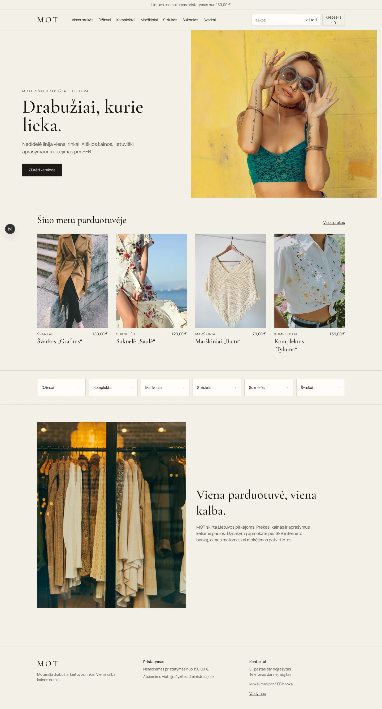


# MOT

Moteriškų drabužių parduotuvė Lietuvos rinkai. Viena kalba. Prekes, kainas ir aprašymus keliate administracijoje. Mokėjimas vyksta per SEB Bank Link (Payment Initiation v009).





## Paleidimas

Reikia Node.js 22.14 ar naujesnio.

```bash
npm install
npm run dev
```

Parduotuvė: http://localhost:3000

Valdymas: http://localhost:3000/admin

Kol nenustatytas `ADMIN_PASSWORD`, slaptažodis yra `mot-admin`.

## Administracija

- **Prekės** — pavadinimas, kaina, aprašymas, kategorija, dydžiai, likutis, nuotraukos, rodymas parduotuvėje.
- **Užsakymai** — pirkėjos duomenys ir būsena.
- **SEB** — prekybininko ID, banko adresas, privatus raktas ir banko sertifikatas.
- **Parduotuvė** — el. paštas, telefonas, atsiėmimo vieta, nemokamo pristatymo riba.

## SEB

Kol neįkelti sutarties duomenys, atsiskaitymas vyksta bandomojoje aplinkoje: paketas pasirašomas, bet pinigai nenuskaičiuojami.

Gyvai reikia visų keturių:

1. Prekybininko ID iš sutarties (`VK_SND_ID`, iki 15 simbolių).
2. Banko adresas, prasidedantis `https://`. SEB (BIC `CBVILT2X`) per mokėjimų inicijavimą dažnai yra `https://pi.swedbank.com/LT/CBVILT2X`. Jei sutartis su SEB duoda kitą adresą, įrašykite jį.
3. Jūsų privataus RSA rakto PEM. Viešą dalį atiduodate bankui.
4. Banko sertifikatas, kuriuo tikrinamas grįžtantis parašas.

Užklausa `1012`, versija `009`, kalba `LIT`, valiuta `EUR`. Lietuvoje siunčiama paskirtis (`VK_MSG`), nuorodos numeris paliekamas tuščias. Grąžinimo adresai:

- `https://jūsų-domenas/api/seb/return`
- `https://jūsų-domenas/api/seb/cancel`

Nustatykite `APP_URL` į viešą adresą be pasviro brūkšnio gale.

## Nuotraukos

Pradinės nuotraukos iš Unsplash. Savo prekių nuotraukas įkeliate administracijoje.
